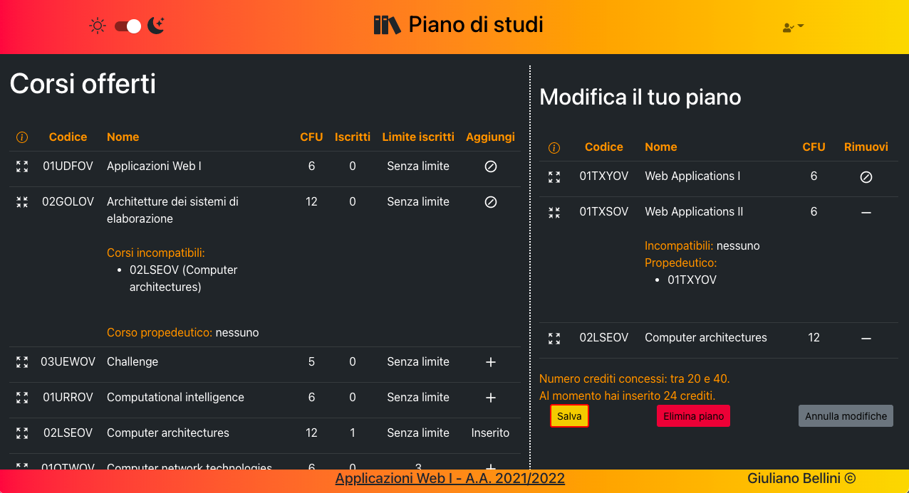

# Exam #1: Piano di studi
## Student: s294739 BELLINI GIULIANO 


## React Client Application Routes

- Route `/login`
  - contenuto: tabella dei corsi, form di login
  - scopo: far autenticare un utente non ancora autenticato (permettendo allo stesso momento di consultare i corsi anche ad utenti non autenticati)
- Route `/iscrizione`
  - contenuto: tabella dei corsi, pulsanti per scegliere il tipo di piano di studi
  - scopo: far scegliere (ad un utente autenticato) il tipo di piano di studi (part-time o full-time)
- Route `/pianostudi`
  - contenuto: tabella dei corsi, tabella dei corsi nel piano di studi dell'utente autenticato
  - scopo: far consultare (ad un utente autenticato) il suo piano di studi
- Route `/pianostudi/modifica`
  - contenuto: tabella dei corsi, tabella dei corsi nel piano di studi dell'utente autenticato, con pulsanti ed icone per modificare il piano di studi
  - scopo: far modificare (ad un utente autenticato) il suo piano di studi (aggiungere e rimuovere corsi, salvare o eliminare il piano, annullare modifiche effettuate)

Nota: se nella barra di ricerca viene inserita una route inesistente, viene mostrato un messaggio di errore con un pulsante per riportare un utente autenticato alla pagina con il suo piano di studi oppure riportare un utente non autenticato alla pagina di login

## API Server

### __GET /corsi__

Descrizione: ritorna la lista completa dei corsi con le loro caratteristiche

Request body: _None_

Response: `200 OK` (successo), `500 Internal Server Error`(errore generico)

Response body:
```
[
  {
    "id":1,
    "codice":"02LSEOV",
    "nome":"Computer architectures",
    "crediti":12,
    "maxstudenti":null,
    "iscritti":0,
    "incompatibili":[9],
    "propedeutico":null
  },
  {
    ...
  },
  ...
]
```

### __GET /pianostudi__

Descrizione: ritorna gli id dei corsi inseriti nel piano di studi dello studente loggato, insieme al numero di crediti dello stesso piano di studi

Request body: _None_

Response: `200 OK` (successo), `500 Internal Server Error`(errore generico)

Response body:
```
{
  "corsi":[12,9,19],
  "crediti":23
}
```

### __PUT /pianostudi__

Descrizione: aggiorna il piano di studi dello studente loggato, indicando gli id dei corsi inseriti e l'ammontare di crediti del piano aggiornato. Si occupa anche di aggiornare il numero di iscritti dei corsi inseriti/rimossi.

Request body: 
```
{
  "corsi":[12,9,19],
  "crediti":23
}
```
Response: `200 Ok` (successo), `422 Unprocessable Entity` (corsi del request body non è un vettore OR crediti negativi), `409 Conflict` (uno o più corsi non soddisfano i vincoli di compatibilità e/o propedeuticità OR il computo di crediti non è consistente con gli esami specificati o con il tipo di piano di studi dell'utente OR uno o più corsi hanno raggiunto il limite di iscritti), `404 Not Found` (uno o più corsi inesistenti), `500 Internal Server Error`(errore generico)

Response body: _None_

### __PUT /iscrizione__

Descrizione: aggiorna il tipo di iscrizione dello studente loggato

Request body: 
```
{
  "iscrizione":"full-time"
}
```
Response: `200 Ok` (successo), `422 Unprocessable Entity` (tipo di iscrizione diverso da "part-time", "full-time" e null), `500 Internal Server Error`(errore generico)

Response body: _None_

### __POST /sessions__

Descrizione: permette il login di un utente

Request body: 
```
{
  "username":"io@io.it",
  "password":"password"
}
```

Response body:
```
{
  "id":1,
  "username":"io@io.it",
  "name":"Giuliano",
  "iscrizione":"part-time"
}
```

### __GET /sessions/current__

Descrizione: ritorna informazioni sull'utente loggato

Request body: _None_

Response body:
```
{
  "id":1,
  "username":"io@io.it",
  "name":"Giuliano",
  "iscrizione":"part-time"
}
```

### __DELETE /sessions/current__

Descrizione: permette il logout di un utente

Request body: _None_

Response body: _None_

## Database Tables

- Tabella `CORSO`
  - `ID`: chiave primaria (numero intero incrementale)
  - `CODICE`: codice univoco del corso (stringa)
  - `NOME`: nome del corso (stringa)
  - `CREDITI`: numero crediti del corso (intero)
  - `MAXSTUDENTI`: massimo iscritti ammissibili del corso (intero, NULL se no limite iscritti)
  - `ISCRITTI`: iscritti attuali del corso (intero)
  - `INCOMPATIBILI`: collezione degli ID dei corsi incompatibili (stringa, NULL se nessun corso incompatibile)
  - `PROPEDEUTICO`: ID del corso propedeutico (stringa, NULL se nessun corso propedeutico)

- Tabella `USER`
  - `id`: chiave primaria (numero intero incrementale)
  - `email`: username univoco dell'utente (stringa)
  - `name`: nome dell'utente (stringa)
  - `hash`: hash calcolato sulla password e sul salt dell'utente (intero)
  - `salt`: stringa casuale di 16 caratteri esadecimali (stringa)
  - `iscrizione`: tipo di piano di studi dell'utente (stringa 'part-time' o 'full-time', NULL se utente non ha ancora scelto il tipo di piano studi)

- Tabella `ISCRIZIONE`
  - `IDUSER`: chiave primaria, indica lo user a cui la tupla si riferisce (numero intero)
  - `CORSI`: collezione degli ID dei corsi nel piano di studi (stringa)
  - `CREDITI`: numero di crediti del piano di studi (intero)


## Main React Components

- File `MyLoginForm.js`:
  - `MyLoginForm`: form per l'autenticazione degli utenti
- File `MyIscrizione.js`:
  - `MyIscrizione`: pulsanti per la scelta del tipo di iscrizione (part-time o sull-time)
- File `MyTable.js`:
  - `MyTable`: tabella dei corsi
  - `MyCourse`: singola riga nella tabella dei corsi
- File `MyPianoStudi.js`:
  - `MyPianoStudi`: tabella con il piano di studi dell'utente autenticato
  - `MyPianoCourse`: singola riga nella tabella del piano di studi dell'utente autenticato
- File `MyAlerts.js`:
  - `MyAlerts`: messaggi informativi di errore a comparsa (gestione errori delle API server, errori di database, errori di compilazione del form di login, vincoli sui corsi e sul numero di crediti selezionabili)
- File `MyNotFound.js`:
  - `MyNotFound`: pagina di errore in caso di route invalida, con pulsante per ritornare all'applicazione
- File `MyNavbar.js`:
  - `MyNavbar`: barra all'estremità superiore dell'applicazione
- File `MyFooter.js`:
  - `MyFooter`: barra all'estremità inferiore dell'applicazione


## Screenshot



## Users Credentials

| email | password | nome | tipo iscrizione
|-------|----------|------|-----|
| io@io.it | password | Giuliano | part-time |
| a@a.it | password | Giacomo | part-time |
| b@b.it | password | Martina | full-time |
| c@c.it | password | Anna | part-time |
| d@d.it | password | Marcello | full-time |
| e@e.it | password | Bianca | non ancora iscritta |

Nota #1: per semplicità ho scelto la stessa password per tutti gli utenti e il form di login è precompilato con le credenziali del primo utente della tabella sopra riportata.

Nota #2: nonostante la password sia la stessa, l'hash della password memorizzato nel database è unico per ogni utente in quanto generato a partire da salt differenti.


## Nota dell'autore
Il caricamento dei corsi e del piano di studi dal server avvengono mostrando brevissime fasi (0.2 secondi) di attesa, in quanto ho impostato un ritardo 'artificiale' per mezzo di chiamate a `setTimeout()` nelle rispettive API.
L'ho ritenuto necessario perché risultava visivamente fastidioso vedere comparire e scomparire gli avvertimenti di caricamento in pochi microsecondi; ho valutato un tempo di 200 millisecondi come compromesso per non fare perdere tempo in fase di correzione e al contempo evitare il sopracitato fastidio e avere transizioni più "smooth".
Un'altra soluzione sarebbe stata quella di non gestire le fasi di caricamento ma non mi sembrava una soluzione completa né tantomeno in linea con quanto visto a lezione.
Ad ogni modo, tale ritardo può essere cambiato ed eventualmente azzerato per mezzo della variabile `ritardo` a riga 4 di index.js.
